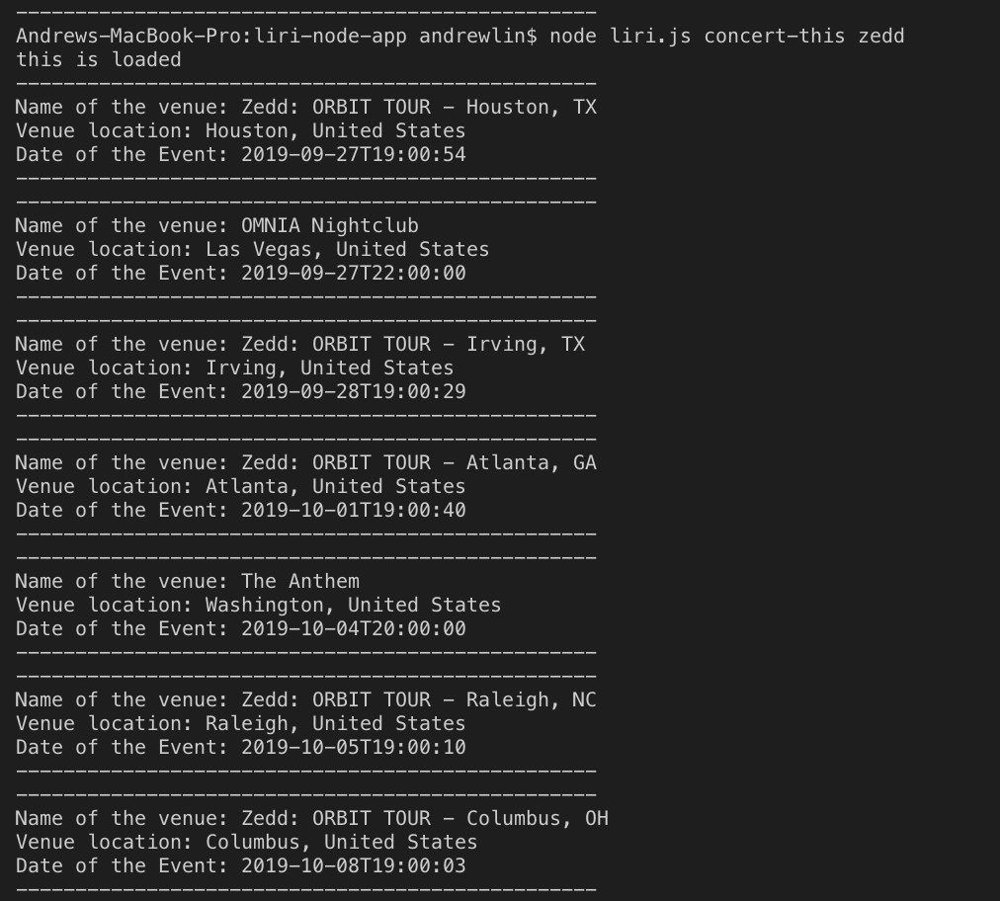
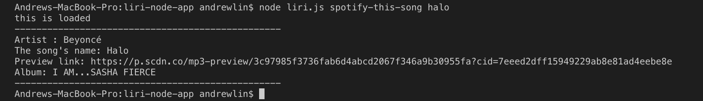
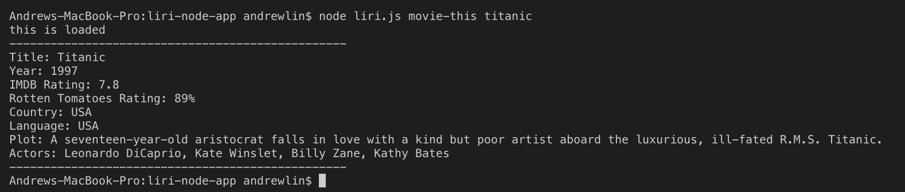
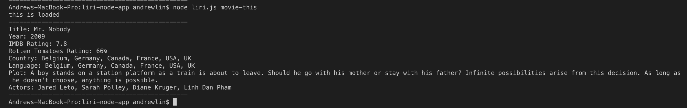
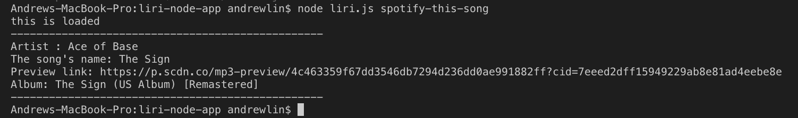
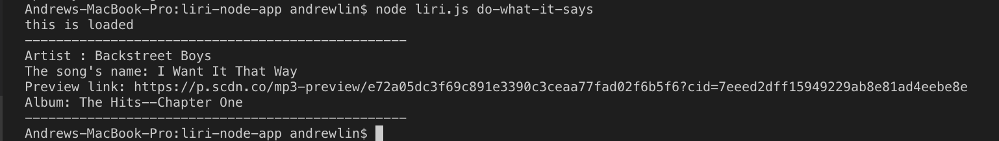
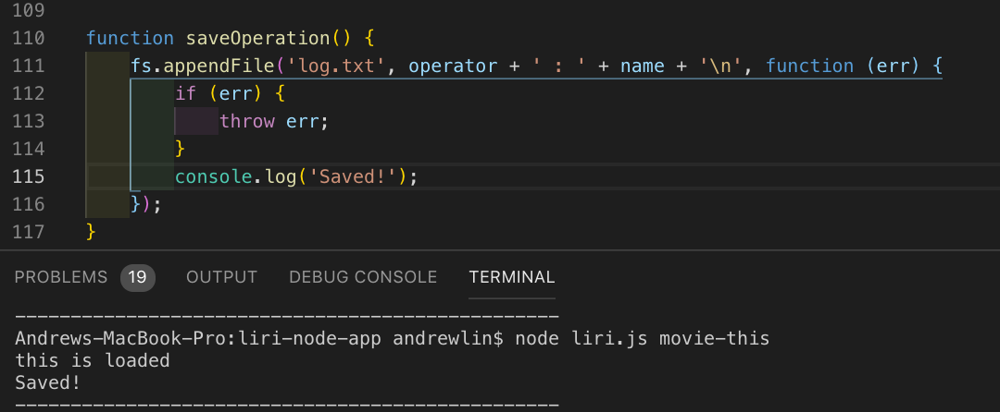
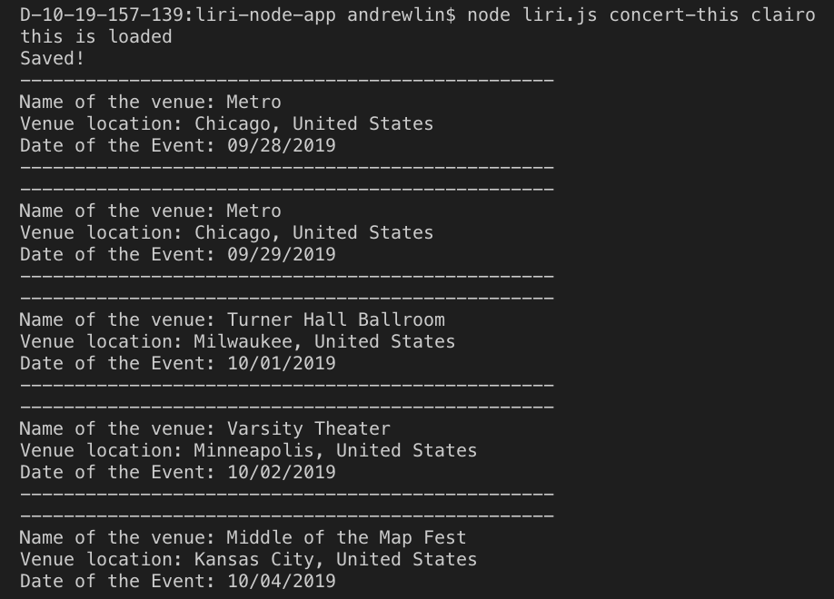

# liri-node-app

check screenshots folder for screenshots

1. node liri.js concert-this zedd;

------------------------------------------------------------

2. node liri.js spotify-this-song halo;

------------------------------------------------------------

3. node liri.js movie-this titanic;

------------------------------------------------------------

4. node liri.js movie-this;

------------------------------------------------------------

5. node liri.js spotify-this-song;

------------------------------------------------------------

6. node liri.js do-what-it-says

------------------------------------------------------------

7. save to log.txt

------------------------------------------------------------

8. changed the time display

------------------------------------------------------------

